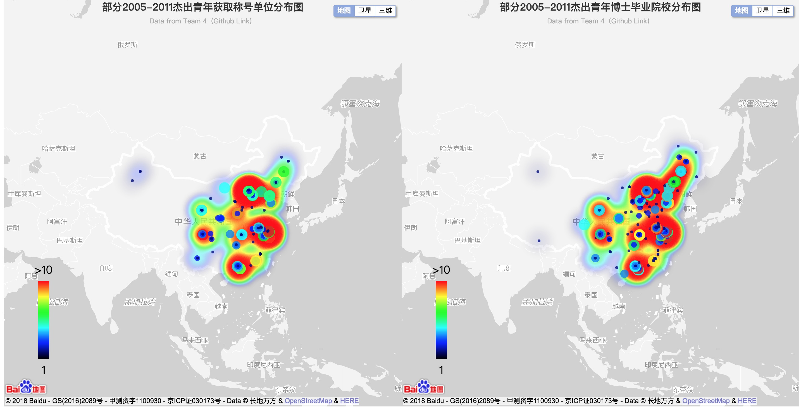
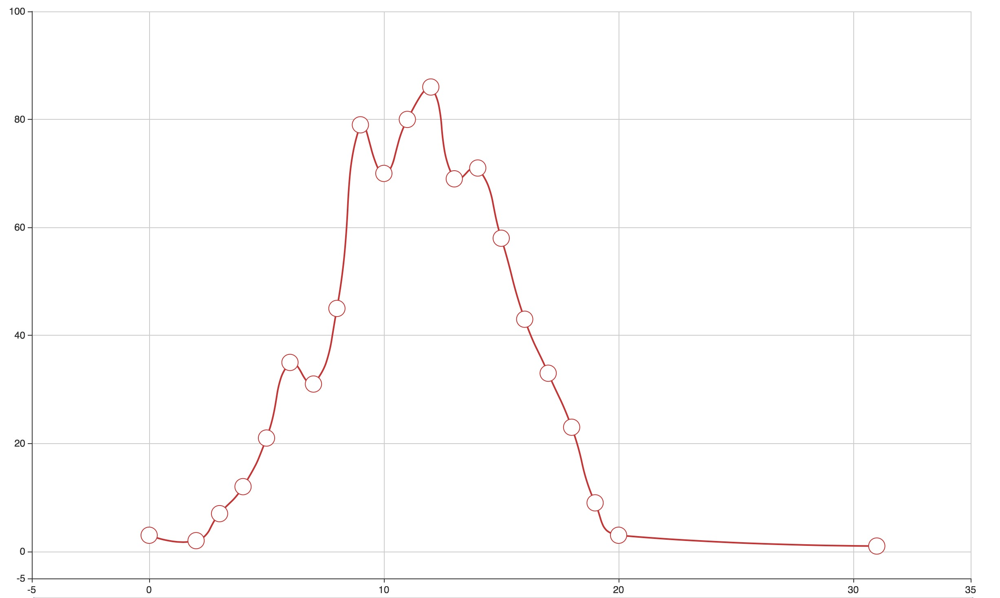
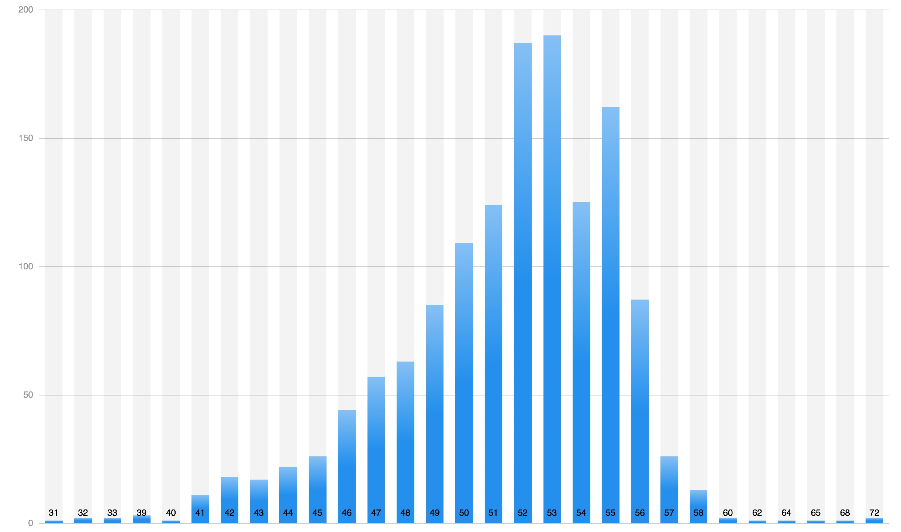

# 人工智能高性能计算（第4组）

#### Group Member：易光启（组长），袁欢，白玲，党高峰，相然，董振

#### Main Work：

* 数据收集 (data/data.xlsx)

* 部分杰青地域分布 (index.html)

* 部分杰青从最终学位到获取称号年数统计 (statistical_1.html)

* 部分杰青年龄统计 (statistical_2.html)

* ppt（第四组.pdf）

#### Dependencies:

* [ECharts](http://echarts.baidu.com) 

#### Index Notes:

* 左边是部分杰青获取称号单位分布图

* 右边是部分杰青博士毕业院校分布图

#### statistical_1 Notes:

* 横轴是所花年数

* 纵轴是统计人数

#### statistical_2 Notes:

* 横轴是年龄

* 纵轴是统计人数

